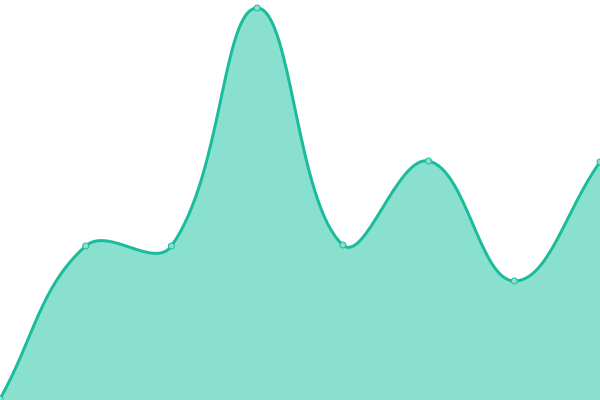
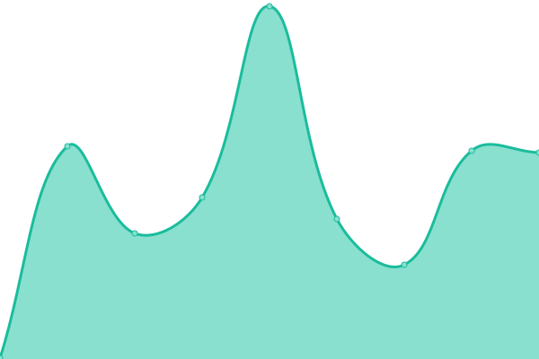
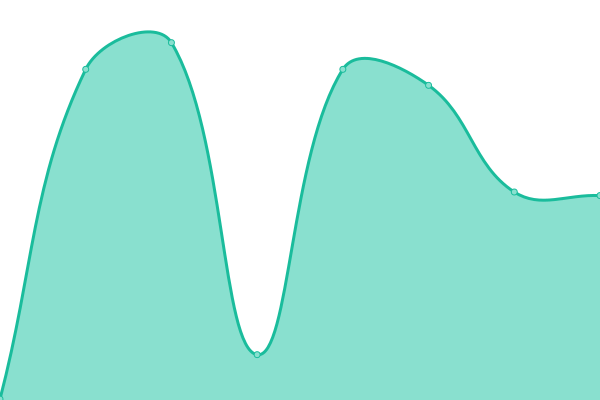
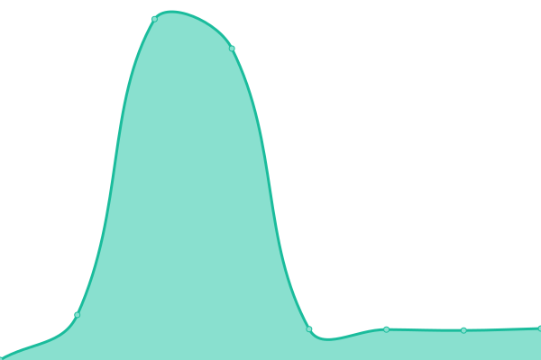

# [📈 Live Status](https://upptime.seediqbale.xyz): <!--live status--> **🟩 All systems operational**

This repository contains the open-source uptime monitor and status page for [Pacific Coast Highway](https://upptime.seediqbale.xyz), powered by [Upptime](https://github.com/upptime/upptime).

With [Upptime](https://upptime.js.org), you can get your own unlimited and free uptime monitor and status page, powered entirely by a GitHub repository. We use [Issues](https://github.com/pchxyz/upptime/issues) as incident reports, [Actions](https://github.com/pchxyz/upptime/actions) as uptime monitors, and [Pages](https://upptime.seediqbale.xyz) for the status page.

<!--start: status pages-->
<!-- This summary is generated by Upptime (https://github.com/upptime/upptime) -->
<!-- Do not edit this manually, your changes will be overwritten -->
<!-- prettier-ignore -->
| URL | Status | History | Response Time | Uptime |
| --- | ------ | ------- | ------------- | ------ |
|  [Misskey](https://seediqbale.xyz) | 🟩 Up | [misskey.yml](https://github.com/pchxyz/upptime/commits/HEAD/history/misskey.yml) | 

 327ms
     
 | 

<a href="https://upptime.seediqbale.xyz/history/misskey">100.00%</a>
    

|  [Plume](https://plume.seediqbale.xyz) | 🟩 Up | [plume.yml](https://github.com/pchxyz/upptime/commits/HEAD/history/plume.yml) | 

 764ms
     
 | 

<a href="https://upptime.seediqbale.xyz/history/plume">99.77%</a>
    

|  [ActivityRelay](https://relay-tw.seediqbale.xyz) | 🟩 Up | [activity-relay.yml](https://github.com/pchxyz/upptime/commits/HEAD/history/activity-relay.yml) | 

 264ms
     
 | 

<a href="https://upptime.seediqbale.xyz/history/activity-relay">100.00%</a>
    

|  [Aode Relay](https://aode.seediqbale.xyz) | 🟩 Up | [aode-relay.yml](https://github.com/pchxyz/upptime/commits/HEAD/history/aode-relay.yml) | 

 295ms
     
 | 

<a href="https://upptime.seediqbale.xyz/history/aode-relay">100.00%</a>
    

|  [Invidious](https://invidious.seediqbale.xyz) | 🟩 Up | [invidious.yml](https://github.com/pchxyz/upptime/commits/HEAD/history/invidious.yml) | 

 271ms
     
 | 

<a href="https://upptime.seediqbale.xyz/history/invidious">100.00%</a>
    

<!--end: status pages-->

[**Visit our status website →**](https://upptime.seediqbale.xyz)

## 📄 License

- Powered by: [Upptime](https://github.com/upptime/upptime)
- Code: [MIT](./LICENSE) © [Anand Chowdhary](https://anandchowdhary.com), supported by [Pabio](https://pabio.com)
- Data in the `./history` directory: [Open Database License](https://opendatacommons.org/licenses/odbl/1-0/)
